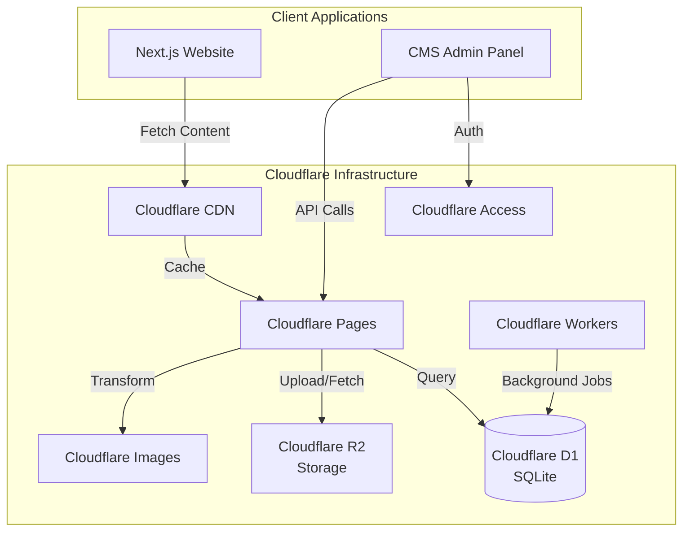

# Omni-CMS Project Overview

## Introduction

Omni-CMS is a headless content management system designed to manage content for multiple websites from a single platform. Built on Cloudflare's infrastructure, it provides a scalable, performant, and globally distributed solution for content management.

## Key Features

### Multi-Tenancy
- **Organizations**: Each organization represents a website
- **Isolated Data**: Complete data isolation between organizations
- **Organization Settings**: Custom branding, domains, and configurations per organization

### Content Management
- **Custom Post Types**: Define custom content types (blogs, pages, products, etc.)
- **Rich Text Editor**: TipTap-based editor with full formatting capabilities
- **Custom Fields**: Flexible field system supporting multiple data types
- **Media Management**: Upload and manage images, videos, and files via Cloudflare R2
- **Taxonomies**: Categories, labels, and tags for content organization
- **Relationships**: Support for one-to-many, many-to-many, and hierarchical relationships

### User Management & Permissions
- **Cloudflare Access**: Enterprise-grade authentication
- **Role-Based Access Control (RBAC)**: Granular permissions system
- **Super Admin**: Global access across all organizations
- **Organization-Scoped Users**: Users with permissions limited to specific organizations
- **Multi-Organization Membership**: Users can belong to multiple organizations with different roles

### API & Integration
- **Public API**: RESTful endpoints for fetching content in Next.js projects
- **Admin API**: Full CRUD operations for content management
- **Filtering & Pagination**: Advanced querying capabilities
- **Caching**: Cloudflare CDN caching for optimal performance

## Technology Stack

### Frontend
- **Framework**: Next.js 14+ (App Router)
- **Language**: TypeScript
- **Styling**: Tailwind CSS
- **Rich Text Editor**: TipTap
- **UI Components**: shadcn/ui

### Backend
- **Runtime**: Cloudflare Workers / Next.js API Routes
- **Database**: Cloudflare D1 (SQLite)
- **ORM**: Drizzle ORM
- **Storage**: Cloudflare R2
- **Image Optimization**: Cloudflare Images

### Authentication & Security
- **Authentication**: Cloudflare Access
- **Authorization**: Custom RBAC implementation
- **Data Isolation**: Row-level security via organization_id

### Deployment
- **Hosting**: Cloudflare Pages
- **Workers**: Cloudflare Workers (if needed for specific tasks)
- **CDN**: Cloudflare CDN (automatic)

## Architecture Overview

## Core Concepts

### Organizations
Organizations are the top-level entity representing individual websites. Each organization has:
- Unique identifier
- Name and slug
- Settings (branding, domains, etc.)
- Isolated content and users

### Post Types
Post types define the structure of content. Examples:
- **Blog Post**: Title, content, author, publish date
- **Page**: Title, content, template
- **Product**: Name, description, price, images
- **Custom**: User-defined types with custom fields

### Custom Fields
Flexible field system supporting:
- **Text**: Single line, multi-line
- **Number**: Integer, decimal
- **Date/Time**: Date, datetime
- **Boolean**: True/false
- **Rich Text**: Formatted content
- **Media**: Images, videos, files
- **Relation**: Links to other content
- **Select**: Dropdown, multi-select
- **JSON**: Structured data

### Taxonomies
Organize content with:
- **Categories**: Hierarchical classification
- **Tags**: Non-hierarchical labels
- **Custom Taxonomies**: User-defined classification systems

### Relationships
Connect content with:
- **One-to-Many**: Parent → Children (e.g., Category → Posts)
- **Many-to-Many**: Bidirectional (e.g., Posts ↔ Tags)
- **Hierarchical**: Parent → Child → Grandchild (e.g., Page structure)

## User Roles & Permissions

### Super Admin
- Access to all organizations
- Manage organizations
- Manage all users
- Full system configuration

### Organization Admin
- Full access within assigned organization(s)
- Manage organization users
- Manage content and settings

### Editor
- Create, edit, publish content
- Manage media
- Limited settings access

### Author
- Create and edit own content
- Cannot publish without approval

### Viewer
- Read-only access to content

## Use Cases

1. **Multi-Site Blog Network**: Manage blogs for multiple brands from one dashboard
2. **Agency Content Hub**: Agencies managing content for multiple clients
3. **Enterprise Content Platform**: Large organizations with multiple websites/brands
4. **SaaS Documentation**: Multi-tenant documentation system
5. **E-commerce Content**: Product catalogs across multiple stores

## Project Goals

1. **Performance**: Leverage Cloudflare's global network for fast content delivery
2. **Scalability**: Handle multiple organizations and high traffic
3. **Flexibility**: Support any content structure via custom fields
4. **Security**: Enterprise-grade authentication and data isolation
5. **Developer Experience**: Clean API, TypeScript, modern tooling
6. **User Experience**: Intuitive admin interface with rich editing capabilities
