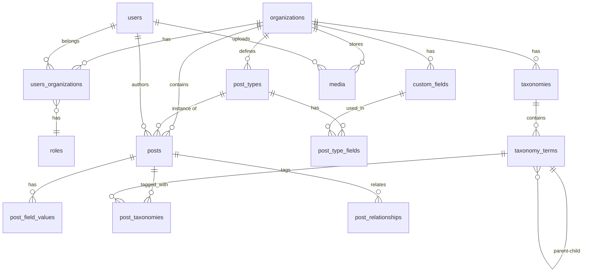

# Database Schema

## Overview

The database schema is designed for multi-tenancy with complete data isolation between organizations. All content-related tables include an `organization_id` foreign key to ensure proper scoping.

## Entity Relationship Diagram

## Core Tables

### organizations
Represents individual websites/brands.

| Column | Type | Constraints | Description |
|--------|------|-------------|-------------|
| id | TEXT | PRIMARY KEY | UUID |
| name | TEXT | NOT NULL | Organization name |
| slug | TEXT | UNIQUE, NOT NULL | URL-friendly identifier |
| domain | TEXT | NULLABLE | Custom domain |
| settings | TEXT | NULLABLE | JSON settings |
| created_at | INTEGER | NOT NULL | Unix timestamp |
| updated_at | INTEGER | NOT NULL | Unix timestamp |

**Indexes:**
- `idx_organizations_slug` on `slug`

---

### users
Global user accounts.

| Column | Type | Constraints | Description |
|--------|------|-------------|-------------|
| id | TEXT | PRIMARY KEY | UUID |
| email | TEXT | UNIQUE, NOT NULL | User email |
| name | TEXT | NOT NULL | Full name |
| avatar_url | TEXT | NULLABLE | Profile image |
| is_super_admin | INTEGER | DEFAULT 0 | Boolean (0/1) |
| created_at | INTEGER | NOT NULL | Unix timestamp |
| updated_at | INTEGER | NOT NULL | Unix timestamp |

**Indexes:**
- `idx_users_email` on `email`

---

### roles
Predefined roles for RBAC.

| Column | Type | Constraints | Description |
|--------|------|-------------|-------------|
| id | TEXT | PRIMARY KEY | UUID |
| name | TEXT | UNIQUE, NOT NULL | Role name |
| description | TEXT | NULLABLE | Role description |
| permissions | TEXT | NOT NULL | JSON array of permissions |
| created_at | INTEGER | NOT NULL | Unix timestamp |

**Default Roles:**
- `super_admin`: Full system access
- `org_admin`: Full organization access
- `editor`: Create/edit/publish content
- `author`: Create/edit own content
- `viewer`: Read-only access

---

### users_organizations
Many-to-many relationship between users and organizations with roles.

| Column | Type | Constraints | Description |
|--------|------|-------------|-------------|
| id | TEXT | PRIMARY KEY | UUID |
| user_id | TEXT | FK → users.id | User reference |
| organization_id | TEXT | FK → organizations.id | Organization reference |
| role_id | TEXT | FK → roles.id | Role reference |
| created_at | INTEGER | NOT NULL | Unix timestamp |

**Indexes:**
- `idx_users_orgs_user` on `user_id`
- `idx_users_orgs_org` on `organization_id`
- Unique constraint on `(user_id, organization_id)`

---

## Content Tables

### post_types
Define content types (blog, page, product, etc.).

| Column | Type | Constraints | Description |
|--------|------|-------------|-------------|
| id | TEXT | PRIMARY KEY | UUID |
| organization_id | TEXT | FK → organizations.id | Organization reference |
| name | TEXT | NOT NULL | Display name |
| slug | TEXT | NOT NULL | URL-friendly identifier |
| description | TEXT | NULLABLE | Type description |
| icon | TEXT | NULLABLE | Icon identifier |
| is_hierarchical | INTEGER | DEFAULT 0 | Supports parent-child |
| settings | TEXT | NULLABLE | JSON settings |
| created_at | INTEGER | NOT NULL | Unix timestamp |
| updated_at | INTEGER | NOT NULL | Unix timestamp |

**Indexes:**
- `idx_post_types_org` on `organization_id`
- Unique constraint on `(organization_id, slug)`

---

### custom_fields
Define reusable custom field definitions.

| Column | Type | Constraints | Description |
|--------|------|-------------|-------------|
| id | TEXT | PRIMARY KEY | UUID |
| organization_id | TEXT | FK → organizations.id | Organization reference |
| name | TEXT | NOT NULL | Field name |
| slug | TEXT | NOT NULL | Field identifier |
| field_type | TEXT | NOT NULL | text, number, date, etc. |
| settings | TEXT | NULLABLE | JSON field config |
| created_at | INTEGER | NOT NULL | Unix timestamp |
| updated_at | INTEGER | NOT NULL | Unix timestamp |

**Field Types:**
- `text`: Single-line text
- `textarea`: Multi-line text
- `rich_text`: HTML content
- `number`: Numeric value
- `boolean`: True/false
- `date`: Date value
- `datetime`: Date and time
- `media`: Media reference
- `relation`: Post reference
- `select`: Single choice
- `multi_select`: Multiple choices
- `json`: Structured data

**Indexes:**
- `idx_custom_fields_org` on `organization_id`
- Unique constraint on `(organization_id, slug)`

---

### post_type_fields
Links custom fields to post types.

| Column | Type | Constraints | Description |
|--------|------|-------------|-------------|
| id | TEXT | PRIMARY KEY | UUID |
| post_type_id | TEXT | FK → post_types.id | Post type reference |
| custom_field_id | TEXT | FK → custom_fields.id | Field reference |
| is_required | INTEGER | DEFAULT 0 | Boolean (0/1) |
| default_value | TEXT | NULLABLE | Default value |
| order | INTEGER | DEFAULT 0 | Display order |
| created_at | INTEGER | NOT NULL | Unix timestamp |

**Indexes:**
- `idx_post_type_fields_type` on `post_type_id`
- Unique constraint on `(post_type_id, custom_field_id)`

---

### posts
Actual content instances.

| Column | Type | Constraints | Description |
|--------|------|-------------|-------------|
| id | TEXT | PRIMARY KEY | UUID |
| organization_id | TEXT | FK → organizations.id | Organization reference |
| post_type_id | TEXT | FK → post_types.id | Post type reference |
| author_id | TEXT | FK → users.id | Author reference |
| title | TEXT | NOT NULL | Post title |
| slug | TEXT | NOT NULL | URL-friendly identifier |
| content | TEXT | NULLABLE | Main content (rich text) |
| excerpt | TEXT | NULLABLE | Short description |
| status | TEXT | DEFAULT 'draft' | draft, published, archived |
| parent_id | TEXT | NULLABLE FK → posts.id | Parent post (hierarchical) |
| featured_image_id | TEXT | NULLABLE FK → media.id | Featured image |
| published_at | INTEGER | NULLABLE | Publish timestamp |
| created_at | INTEGER | NOT NULL | Unix timestamp |
| updated_at | INTEGER | NOT NULL | Unix timestamp |

**Indexes:**
- `idx_posts_org` on `organization_id`
- `idx_posts_type` on `post_type_id`
- `idx_posts_author` on `author_id`
- `idx_posts_status` on `status`
- `idx_posts_parent` on `parent_id`
- Unique constraint on `(organization_id, post_type_id, slug)`

---

### post_field_values
Stores custom field values for posts.

| Column | Type | Constraints | Description |
|--------|------|-------------|-------------|
| id | TEXT | PRIMARY KEY | UUID |
| post_id | TEXT | FK → posts.id | Post reference |
| custom_field_id | TEXT | FK → custom_fields.id | Field reference |
| value | TEXT | NULLABLE | Field value (JSON for complex types) |
| created_at | INTEGER | NOT NULL | Unix timestamp |
| updated_at | INTEGER | NOT NULL | Unix timestamp |

**Indexes:**
- `idx_post_field_values_post` on `post_id`
- `idx_post_field_values_field` on `custom_field_id`
- Unique constraint on `(post_id, custom_field_id)`

---

## Taxonomy Tables

### taxonomies
Define taxonomy types (categories, tags, etc.).

| Column | Type | Constraints | Description |
|--------|------|-------------|-------------|
| id | TEXT | PRIMARY KEY | UUID |
| organization_id | TEXT | FK → organizations.id | Organization reference |
| name | TEXT | NOT NULL | Taxonomy name |
| slug | TEXT | NOT NULL | URL-friendly identifier |
| is_hierarchical | INTEGER | DEFAULT 0 | Supports parent-child |
| created_at | INTEGER | NOT NULL | Unix timestamp |
| updated_at | INTEGER | NOT NULL | Unix timestamp |

**Indexes:**
- `idx_taxonomies_org` on `organization_id`
- Unique constraint on `(organization_id, slug)`

---

### taxonomy_terms
Individual terms within taxonomies.

| Column | Type | Constraints | Description |
|--------|------|-------------|-------------|
| id | TEXT | PRIMARY KEY | UUID |
| taxonomy_id | TEXT | FK → taxonomies.id | Taxonomy reference |
| name | TEXT | NOT NULL | Term name |
| slug | TEXT | NOT NULL | URL-friendly identifier |
| description | TEXT | NULLABLE | Term description |
| parent_id | TEXT | NULLABLE FK → taxonomy_terms.id | Parent term |
| created_at | INTEGER | NOT NULL | Unix timestamp |
| updated_at | INTEGER | NOT NULL | Unix timestamp |

**Indexes:**
- `idx_taxonomy_terms_taxonomy` on `taxonomy_id`
- `idx_taxonomy_terms_parent` on `parent_id`
- Unique constraint on `(taxonomy_id, slug)`

---

### post_taxonomies
Many-to-many relationship between posts and taxonomy terms.

| Column | Type | Constraints | Description |
|--------|------|-------------|-------------|
| id | TEXT | PRIMARY KEY | UUID |
| post_id | TEXT | FK → posts.id | Post reference |
| taxonomy_term_id | TEXT | FK → taxonomy_terms.id | Term reference |
| created_at | INTEGER | NOT NULL | Unix timestamp |

**Indexes:**
- `idx_post_taxonomies_post` on `post_id`
- `idx_post_taxonomies_term` on `taxonomy_term_id`
- Unique constraint on `(post_id, taxonomy_term_id)`

---

## Relationship Tables

### post_relationships
Define relationships between posts.

| Column | Type | Constraints | Description |
|--------|------|-------------|-------------|
| id | TEXT | PRIMARY KEY | UUID |
| from_post_id | TEXT | FK → posts.id | Source post |
| to_post_id | TEXT | FK → posts.id | Target post |
| relationship_type | TEXT | NOT NULL | Type of relationship |
| created_at | INTEGER | NOT NULL | Unix timestamp |

**Relationship Types:**
- `related`: General relation
- `reference`: Citation/reference
- `prerequisite`: Required reading
- Custom types defined by users

**Indexes:**
- `idx_post_relationships_from` on `from_post_id`
- `idx_post_relationships_to` on `to_post_id`
- `idx_post_relationships_type` on `relationship_type`

---

## Media Tables

### media
Store uploaded files metadata.

| Column | Type | Constraints | Description |
|--------|------|-------------|-------------|
| id | TEXT | PRIMARY KEY | UUID |
| organization_id | TEXT | FK → organizations.id | Organization reference |
| uploader_id | TEXT | FK → users.id | Uploader reference |
| filename | TEXT | NOT NULL | Original filename |
| file_key | TEXT | NOT NULL | R2 storage key |
| mime_type | TEXT | NOT NULL | File MIME type |
| file_size | INTEGER | NOT NULL | Size in bytes |
| width | INTEGER | NULLABLE | Image width |
| height | INTEGER | NULLABLE | Image height |
| alt_text | TEXT | NULLABLE | Accessibility text |
| caption | TEXT | NULLABLE | Media caption |
| metadata | TEXT | NULLABLE | JSON metadata |
| created_at | INTEGER | NOT NULL | Unix timestamp |
| updated_at | INTEGER | NOT NULL | Unix timestamp |

**Indexes:**
- `idx_media_org` on `organization_id`
- `idx_media_uploader` on `uploader_id`
- `idx_media_type` on `mime_type`

---

## Data Isolation Strategy

All organization-scoped tables include `organization_id` to ensure:
1. **Query Filtering**: All queries automatically filter by organization
2. **Data Integrity**: Foreign keys prevent cross-organization references
3. **Performance**: Indexes on `organization_id` optimize queries
4. **Security**: Application-level checks enforce organization context

## Migration Strategy

Using Drizzle ORM migrations:
1. Create schema definitions in TypeScript
2. Generate SQL migrations
3. Apply migrations to Cloudflare D1
4. Version control all migrations
