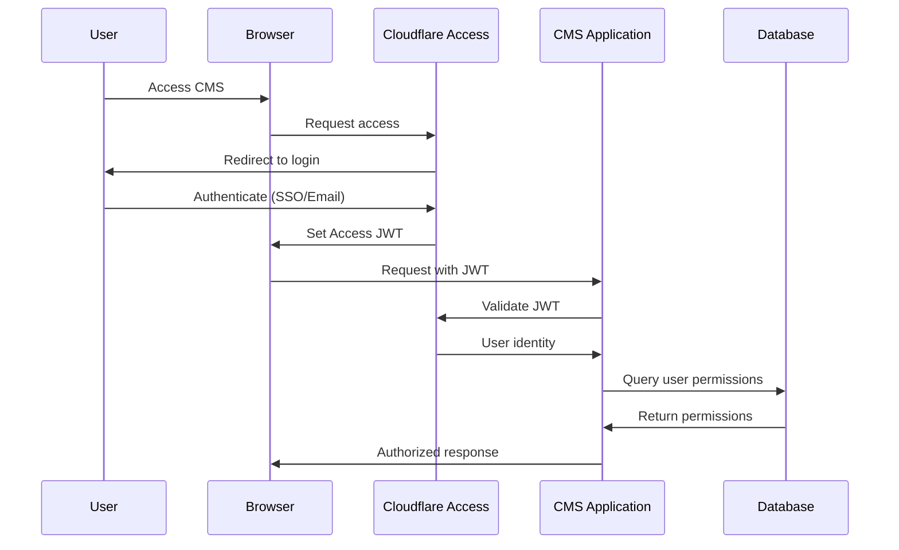
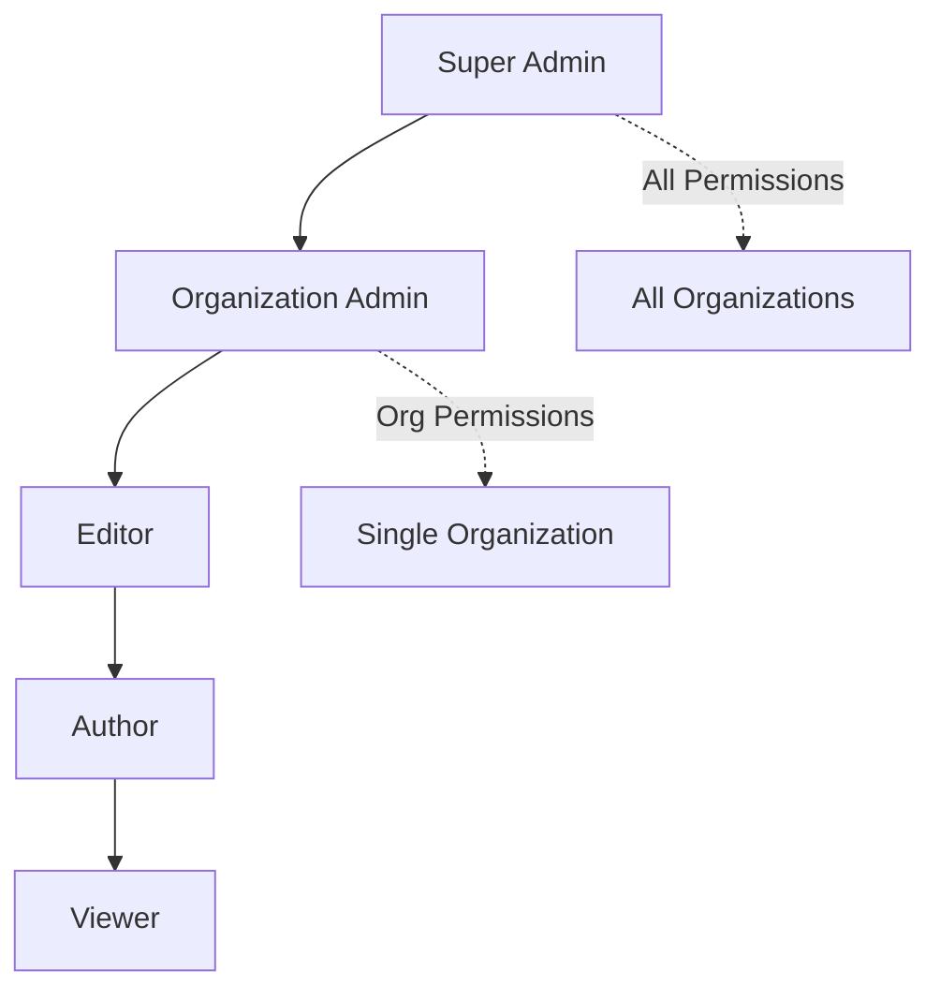

# Authentication & Permissions

## Overview

The Omni-CMS uses Cloudflare Access for authentication and implements a custom Role-Based Access Control (RBAC) system for authorization. This ensures enterprise-grade security while maintaining flexibility for multi-tenant operations.

## Authentication Flow

### Cloudflare Access



### Access Configuration

**Cloudflare Access Setup:**
1. Create Access Application for CMS domain
2. Configure identity providers (Google, GitHub, Email OTP, etc.)
3. Set access policies (email domain, specific users, etc.)
4. Enable JWT validation

**JWT Claims:**
```json
{
  "email": "user@example.com",
  "name": "John Doe",
  "sub": "cloudflare-user-id",
  "iat": 1234567890,
  "exp": 1234571490
}
```

### Application-Level Authentication

The application extracts user identity from Cloudflare Access JWT:

```typescript
// Middleware to extract user from Access JWT
async function getAuthenticatedUser(request: Request) {
  const jwt = request.headers.get('Cf-Access-Jwt-Assertion');
  
  if (!jwt) {
    throw new Error('Unauthorized');
  }
  
  // Validate JWT with Cloudflare Access
  const payload = await validateAccessJWT(jwt);
  
  // Get or create user in database
  const user = await db.query.users.findFirst({
    where: eq(users.email, payload.email)
  });
  
  if (!user) {
    // Auto-provision user on first login
    const newUser = await db.insert(users).values({
      id: generateUUID(),
      email: payload.email,
      name: payload.name,
      created_at: Date.now(),
      updated_at: Date.now()
    }).returning();
    
    return newUser[0];
  }
  
  return user;
}
```

## Authorization System

### Role-Based Access Control (RBAC)

The system implements RBAC with the following hierarchy:



### Permission Model

Permissions are granular and action-based:

**Format:** `resource:action`

**Examples:**
- `organizations:create`
- `organizations:read`
- `organizations:update`
- `organizations:delete`
- `posts:create`
- `posts:read`
- `posts:update`
- `posts:publish`
- `posts:delete`
- `users:create`
- `users:read`
- `users:update`
- `users:delete`
- `media:upload`
- `media:read`
- `media:delete`
- `settings:read`
- `settings:update`

### Default Roles

#### Super Admin
**Scope:** Global (all organizations)

**Permissions:**
```json
[
  "organizations:*",
  "posts:*",
  "users:*",
  "media:*",
  "settings:*",
  "taxonomies:*",
  "post-types:*",
  "custom-fields:*"
]
```

**Capabilities:**
- Create, read, update, delete organizations
- Access all organization data
- Manage all users across all organizations
- Full system configuration

---

#### Organization Admin
**Scope:** Organization-specific

**Permissions:**
```json
[
  "organizations:read",
  "organizations:update",
  "posts:*",
  "users:create",
  "users:read",
  "users:update",
  "users:delete",
  "media:*",
  "settings:read",
  "settings:update",
  "taxonomies:*",
  "post-types:*",
  "custom-fields:*"
]
```

**Capabilities:**
- Full access within assigned organization(s)
- Manage organization users and roles
- Create and manage all content
- Configure organization settings

---

#### Editor
**Scope:** Organization-specific

**Permissions:**
```json
[
  "posts:create",
  "posts:read",
  "posts:update",
  "posts:publish",
  "posts:delete",
  "media:upload",
  "media:read",
  "media:delete",
  "taxonomies:read",
  "taxonomies:create",
  "taxonomies:update"
]
```

**Capabilities:**
- Create, edit, and publish all posts
- Manage media library
- Create and manage taxonomies
- Cannot manage users or settings

---

#### Author
**Scope:** Organization-specific (own content only)

**Permissions:**
```json
[
  "posts:create",
  "posts:read",
  "posts:update",
  "media:upload",
  "media:read",
  "taxonomies:read"
]
```

**Capabilities:**
- Create and edit own posts
- Cannot publish (requires approval)
- Upload and use media
- View taxonomies

**Restrictions:**
- Can only edit posts where `author_id` matches user ID
- Cannot delete posts
- Cannot manage other users' content

---

#### Viewer
**Scope:** Organization-specific

**Permissions:**
```json
[
  "posts:read",
  "media:read",
  "taxonomies:read"
]
```

**Capabilities:**
- Read-only access to all content
- View media library
- View taxonomies

---

### Permission Checking

#### Middleware Implementation

```typescript
// Check if user has permission
async function checkPermission(
  userId: string,
  organizationId: string,
  permission: string
): Promise<boolean> {
  // Check if super admin
  const user = await db.query.users.findFirst({
    where: eq(users.id, userId)
  });
  
  if (user?.is_super_admin) {
    return true; // Super admins have all permissions
  }
  
  // Get user's role in organization
  const userOrg = await db.query.users_organizations.findFirst({
    where: and(
      eq(users_organizations.user_id, userId),
      eq(users_organizations.organization_id, organizationId)
    ),
    with: {
      role: true
    }
  });
  
  if (!userOrg) {
    return false; // User not in organization
  }
  
  // Check if role has permission
  const permissions = JSON.parse(userOrg.role.permissions);
  
  // Check for exact match or wildcard
  return permissions.some((p: string) => {
    if (p === permission) return true;
    
    // Check wildcard (e.g., "posts:*" matches "posts:create")
    const [resource, action] = p.split(':');
    const [reqResource, reqAction] = permission.split(':');
    
    return resource === reqResource && action === '*';
  });
}
```

#### Route Protection

```typescript
// API route example
export async function POST(
  request: Request,
  { params }: { params: { orgId: string } }
) {
  // Get authenticated user
  const user = await getAuthenticatedUser(request);
  
  // Check permission
  const hasPermission = await checkPermission(
    user.id,
    params.orgId,
    'posts:create'
  );
  
  if (!hasPermission) {
    return Response.json(
      { success: false, error: { code: 'FORBIDDEN', message: 'Insufficient permissions' } },
      { status: 403 }
    );
  }
  
  // Proceed with post creation
  // ...
}
```

### Organization Context

All API requests must include organization context:

**Methods:**
1. **URL Parameter**: `/api/admin/organizations/:orgId/posts`
2. **Header**: `X-Organization-Id: <org-id>`
3. **Subdomain**: `org-slug.cms.example.com`

The application validates that the user has access to the requested organization before processing the request.

### Multi-Organization Access

Users can belong to multiple organizations with different roles:

```typescript
// Get user's organizations
async function getUserOrganizations(userId: string) {
  const userOrgs = await db.query.users_organizations.findMany({
    where: eq(users_organizations.user_id, userId),
    with: {
      organization: true,
      role: true
    }
  });
  
  return userOrgs.map(uo => ({
    organization: uo.organization,
    role: uo.role
  }));
}
```

**UI Implementation:**
- Organization switcher in header
- Shows all organizations user has access to
- Switching changes context for all subsequent requests

## Data Isolation

### Row-Level Security

All queries automatically filter by organization:

```typescript
// Example: Get posts for organization
async function getPosts(organizationId: string, userId: string) {
  // Verify user has access to organization
  await checkPermission(userId, organizationId, 'posts:read');
  
  // Query automatically scoped to organization
  const posts = await db.query.posts.findMany({
    where: eq(posts.organization_id, organizationId)
  });
  
  return posts;
}
```

### Cross-Organization Prevention

Foreign keys and application logic prevent cross-organization references:

```typescript
// Example: Create post with featured image
async function createPost(data: CreatePostData, organizationId: string) {
  // Verify featured image belongs to same organization
  if (data.featured_image_id) {
    const media = await db.query.media.findFirst({
      where: and(
        eq(media.id, data.featured_image_id),
        eq(media.organization_id, organizationId)
      )
    });
    
    if (!media) {
      throw new Error('Featured image not found or belongs to different organization');
    }
  }
  
  // Create post
  // ...
}
```

## API Key Authentication (Public API)

For public API access, organizations can generate API keys:

### API Key Structure

```typescript
interface APIKey {
  id: string;
  organization_id: string;
  name: string; // e.g., "Production Website"
  key: string; // hashed
  permissions: string[]; // subset of permissions
  rate_limit: number; // requests per hour
  created_at: number;
  last_used_at: number;
  expires_at: number | null;
}
```

### API Key Usage

```typescript
// Validate API key
async function validateAPIKey(key: string): Promise<APIKey | null> {
  const hashedKey = await hashAPIKey(key);
  
  const apiKey = await db.query.api_keys.findFirst({
    where: and(
      eq(api_keys.key, hashedKey),
      or(
        isNull(api_keys.expires_at),
        gt(api_keys.expires_at, Date.now())
      )
    )
  });
  
  if (apiKey) {
    // Update last used
    await db.update(api_keys)
      .set({ last_used_at: Date.now() })
      .where(eq(api_keys.id, apiKey.id));
  }
  
  return apiKey;
}
```

## Security Best Practices

1. **JWT Validation**: Always validate Cloudflare Access JWT
2. **Permission Checks**: Check permissions on every request
3. **Organization Scoping**: Always filter by organization_id
4. **Input Validation**: Validate all user inputs
5. **Rate Limiting**: Implement rate limits per user/API key
6. **Audit Logging**: Log all sensitive operations
7. **HTTPS Only**: Enforce HTTPS for all requests
8. **CORS**: Configure CORS for public API
9. **API Key Rotation**: Support key rotation and revocation
10. **Session Management**: Implement session timeout and refresh

## Audit Logging (Future)

Planned audit logging for compliance:

```typescript
interface AuditLog {
  id: string;
  organization_id: string;
  user_id: string;
  action: string; // e.g., "post:create", "user:delete"
  resource_type: string;
  resource_id: string;
  metadata: object; // Additional context
  ip_address: string;
  user_agent: string;
  created_at: number;
}
```

Track:
- User logins
- Content creation/updates/deletion
- User management actions
- Settings changes
- API key usage
